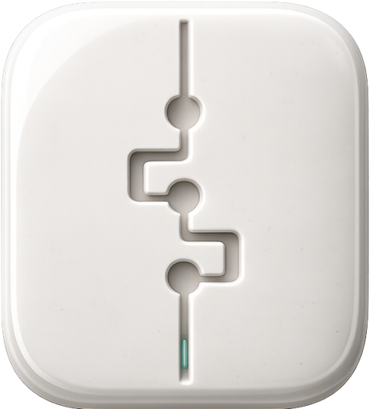

<div align="center">
  
  <h1>Porcelain</h1>
  <p><strong>Where agent work becomes trusted work.</strong></p>
  <p>The hub for agentic coding: run your agents anywhere, review what they built like a senior engineer reads a feature: as a story, not a file list.</p>
</div>

---

Coding agents generate faster than anyone can trust. Every tool in this space races to spawn more agents in more worktrees; the pile of unreviewed diffs just grows. Porcelain stands on the other side of that pile: one lightweight window (not an editor) where your agents run **and** their work becomes something you've actually read, understood, and signed off.

## Why Porcelain

- **The Review.** Your agent doesn't just hand you a diff. It publishes a walkthrough of the whole feature: **Intent** (what and why), **Execution** (flow-ordered files and prose, including unchanged code across the client→server seam a diff can't show), and **Evidence** (proof it verified its own work). You read a document, not a pile.
- **Flow-ordered diffs.** Even without a published Review, changed files are ordered and grouped along their dependency flow (component → hook → route → service → schema) so a change reads from entry point to database instead of alphabetically.
- **A two-way loop.** Review comments on a line or file flow back to your agent as concrete context, and resolutions flow forward. A per-repo project board keeps work queued and moved as agents ship. Agent chat is a shared relay across providers: claims show which files each agent owns, overlaps flag collisions, and you sort it out in the thread. All of it runs through a bundled local CLI. No server, no port, no telemetry.
- **Run the agents inside.** Agent threads for Claude Code, Codex, OpenCode, and Grok, driven through the CLIs you already installed and pay for, with permission modes, model favorites, and image attachments. Threads persist and keep working while you review. Parallel agents can land in worktrees; the Review inbox surfaces every checkout waiting for you.
- **Anywhere is the same place.** One token-gated daemon, three clients: the Mac/Linux app locally, the app pointed at a remote daemon, or any browser on your LAN or tailnet (iPad included). Terminals and review state live daemon-side, so they survive reconnects and follow you across devices.
- **Built for huge monorepos.** Stays fast on a ~50 GB repo. Hide the folders that aren't yours, pin the ones that are; nothing is indexed until you look at it.

## Features

- **Whole-feature review**: agent-authored Review (Intent · Execution · Evidence), outline with per-file reviewed marks, keyboard navigation, zen reading mode
- **Flow-ordered diff review** with per-repo layer definitions, plus read-only **flow exploration** of any existing feature (seed from a symbol or file)
- **Human ↔ agent channels**: review comments with resolutions, a todo/doing/done **project board**, **agent chat** (multi-agent relay with file claims and overlaps), and saved **Actions** your agent curates but only you run
- **Agent threads**: Claude Code, Codex, OpenCode, and Grok in one surface. Permission modes (approve / auto-edits / full), model favorites, image attachments, worktree-per-thread
- **Git**: working-tree diffs (unified or split), per-file staging, history, worktree switching, in-app commits with conventional-commit chips
- **Embedded terminal**: real PTYs, split view, sessions that outlive their tabs and survive client reconnects
- **Fast file viewer**: virtualized rendering, Shiki highlighting, always-editable text (autosave), Markdown reader/source, image support, two-pane split
- **Monorepo navigation**: hide/unhide folders, pin paths, lazy per-directory loading
- **Search & finders**: repo-wide code search, fuzzy file finder, find-in-file, find references
- **Remote access**: LAN (same Wi-Fi) or tailnet (WireGuard). One command on the host:

  ```bash
  npx porcelain-daemon@latest serve --tailnet --print-token
  ```

  Start it when you work, Ctrl+C when you're done. No always-on service required.
- **Light, dark, and system themes**, themed end to end
- **Multi-window**: one repo per window, each window free to pick its own environment (local or remote)
- **Auto-updating** builds (signed and notarized on macOS)

## Install

**macOS (Apple Silicon):** download the latest `.dmg` from [Releases](https://github.com/FabioFiorita/porcelain/releases), drag Porcelain to Applications. Updates install automatically.

**Linux (x64):** grab the `.AppImage` (auto-updates) or `.deb` from the same [Releases](https://github.com/FabioFiorita/porcelain/releases) page.

**Any other device:** you don't install Porcelain, you open it. Run the daemon on a machine you own (command above) and point a browser at it.

## Connect your agent

The agent channel is a bundled CLI, installed to `~/.porcelain/porcelain` automatically on every app launch, always current, no per-agent configuration. It only touches local files: no port, no telemetry.

Teach your agents the workflow with the companion skills, via [skills.sh](https://www.skills.sh):

```bash
npx skills add FabioFiorita/porcelain
```

Run from any repo and choose global or project-local when prompted. Update later with `npx skills upgrade`. Provider setup (install/sign-in status per agent CLI) lives in **Settings → Agents**.

## Positioning

Porcelain sells **trust and review depth**, not agent count. Design identity is **the reading room**: calm, legible, opaque. Full launch copy, X/Product Hunt drafts, and pillar language live in [`plans/launch-narrative.md`](plans/launch-narrative.md); competitive notes in [`plans/positioning-and-roadmap.md`](plans/positioning-and-roadmap.md). Product site: [fabiofiorita.github.io/porcelain](https://fabiofiorita.github.io/porcelain/).

## Develop

Porcelain is built with Electron (electron-vite), React 19, TypeScript (strict), shadcn/ui on Base UI, Tailwind v4, tRPC, TanStack Query, and zustand. State and git access run through a single, deliberately uniform architecture; see [CLAUDE.md](CLAUDE.md) and the skills in [`.agents/skills/`](.agents/skills/).

```bash
pnpm install   # install dependencies
pnpm dev       # run the app in development
```

`pnpm dev` runs against a throwaway playground repo and an isolated config, so it never touches your real repositories.

### Common scripts

| Command | What it does |
|---|---|
| `pnpm dev` | Run the app in development |
| `pnpm lint` | Biome lint + format check |
| `pnpm typecheck` | Type-check main and renderer |
| `pnpm test` | Run the Vitest suite |
| `pnpm test:e2e` | Playwright e2e (headless browser project) |
| `pnpm build` | Type-check and build |
| `pnpm shots` | Regenerate marketing screenshots |
| `pnpm dist` | Build a signed local `.dmg` / `.zip` |
| `pnpm daemon:dist` | Assemble publishable `dist-daemon/` (`porcelain-daemon` npm package) |
| `pnpm release` | Build and publish to GitHub Releases |

The verification gate before any commit is `pnpm verify` (lint + test + build; typecheck runs inside build).

## License

[MIT](LICENSE) © Fabio Fiorita
