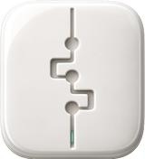

<div align="center">
  
  <h1>Porcelain</h1>
  <p><strong>Where agent work becomes trusted work.</strong></p>
  <p>A lightweight review layer for agentic coding. Agents keep running where they already run; Porcelain is where you inspect, understand, and sign off their work.</p>
</div>

Porcelain is a daemon with browser, Electron, and mobile clients. It brings worktrees, Git changes,
review material, terminals, and remote access into one place without becoming an IDE or an
in-app agent host. Your code stays on machines you control.

## What it provides

- A review story for a unit of work: intent, execution, and evidence.
- Worktree navigation, focused file views, diffs, history, and Git actions.
- Terminals and development servers that belong to the daemon host.
- Browser, Electron, and mobile clients using the same daemon contracts.
- LAN, Tailscale, and Cloudflare access with one-time pairing and independently revocable devices.

## Install

On macOS, download the latest signed application from
[GitHub Releases](https://github.com/FabioFiorita/porcelain/releases). For a browser or mobile
client, run the daemon on the machine that holds the code:

```sh
npx @fabiofiorita/porcelain@latest serve --lan
npx @fabiofiorita/porcelain@latest access issue --name "My phone"
```

Open the one-time link on the device. It expires after 15 minutes and becomes a credential for
that device. Remote exposure and always-on setup are documented in
[docs/remote-access.md](docs/remote-access.md).

## Agent connection

The **porcelain** plugin gives agents the MCP tools and focused skills for Canvases, comments,
Actions, profiles, and remote-daemon setup. Choose the installation route your client
supports:

### Agent Plugin

Agent Plugins leaves installation and distribution to each client. In your agent's native plugin
manager, add the repository `FabioFiorita/porcelain`.

### Claude Plugin

Claude Code can register the repository as a marketplace:

```text
/plugin marketplace add FabioFiorita/porcelain
/plugin install porcelain@porcelain
```


## Development

Porcelain is a pnpm monorepo. The supported development loop, isolated homes, worktrees, browser,
Electron, mobile, testing, and release pointers are in [docs/development.md](docs/development.md).

```sh
pnpm install
pnpm dev:daemon
pnpm dev
```

The primary development daemon uses port `43118`, `~/.porcelain-dev`, and disposable playgrounds.
It must not be used with production state. Current package ownership is summarized in
[docs/architecture.md](docs/architecture.md).

## Contributing

Start with [CONTRIBUTING.md](CONTRIBUTING.md) and [AGENTS.md](AGENTS.md). This repository
documents current behavior and operational facts only.

## License

[MIT](LICENSE) © Fabio Fiorita
